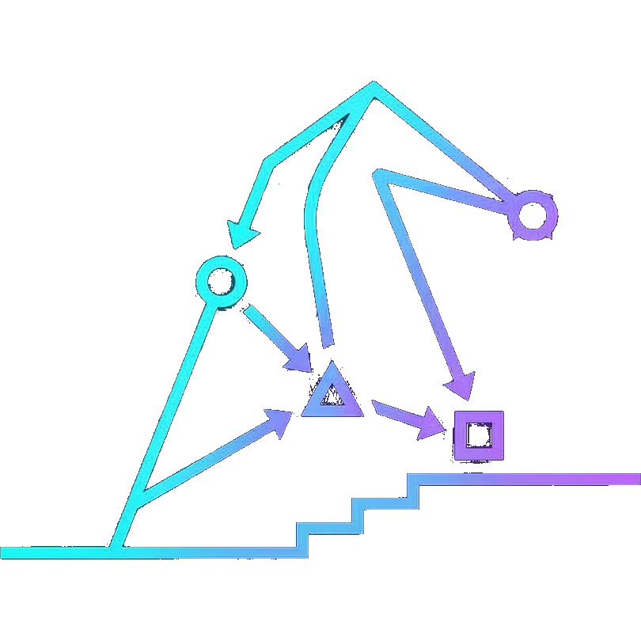

<p align="center">
  
</p>

<h1 align="center">Stepwise</h1>

<p align="center">
  <strong>Step into your flow.</strong><br/>
  Define workflows in YAML. Run them with a real-time web UI. Your AI agents call them as tools.
</p>

<p align="center">
  <a href="https://stepwise.run"><strong>Homepage</strong></a> · <a href="docs/quickstart.md">Quickstart</a> · <a href="docs/agent-integration.md">Agent Integration</a> · <a href="docs/concepts.md">Concepts</a> · <a href="docs/cli.md">CLI Reference</a> · <a href="docs/api.md">API Reference</a>
</p>

---

Stepwise is a workflow engine that coordinates multi-step jobs where each step can be a **shell script**, an **LLM call**, an **autonomous AI agent**, or a **human decision**. Write a `.flow.yaml`, run it from the terminal, and watch it execute in a real-time web UI with DAG visualization and live agent streaming.

## Install + try it

```bash
curl -fsSL https://raw.githubusercontent.com/zackham/stepwise/master/install.sh | sh
```

Try the interactive demo or a real-world code review flow:

```bash
stepwise run @stepwise:welcome --watch
stepwise run @stepwise:code-review --watch
```

`--watch` opens a browser with a real-time DAG visualization. Steps execute automatically — agents stream output live, human steps pause and wait for your input. Drop `--watch` to run headless in the terminal.

## Flows your agents can call

Stepwise flows are callable as tools by AI agents (Claude Code, Codex, etc.) via plain CLI. No MCP servers, no protocol layers — just bash commands that return JSON.

```bash
stepwise run council --wait --var question="Should we use Postgres?"
```

```json
{"status": "completed", "job_id": "job-abc123", "outputs": [{"verdict": "yes", "reasoning": "..."}]}
```

`--wait` prints **only** JSON to stdout — zero logging, zero progress noise. Missing an input? The error tells you exactly which `--var` flags to add.

To generate per-flow instructions your agent can reference:

```bash
stepwise agent-help --update CLAUDE.md
```

This appends tool-calling docs (input schemas, example commands, expected output shapes) to your project's `CLAUDE.md` so agents know how to invoke your flows without any extra configuration.

## How it works

You write a `.flow.yaml` describing steps and their dependencies. Stepwise builds a DAG, runs independent steps in parallel, and executes everything in the right order. When a step needs human input, the job pauses until you respond.

```yaml
name: code-review
steps:
  gather-context:
    run: |
      git diff main --stat && git log main..HEAD --oneline
    outputs: [diff_summary, commits]

  review:
    executor: agent
    prompt: |
      Review this code change. Identify bugs, style issues, and suggest improvements.
      Diff: $diff_summary
      Commits: $commits
    inputs:
      diff_summary: gather-context.diff_summary
      commits: gather-context.commits
    outputs: [verdict, issues, suggestions]

  decide:
    executor: human
    prompt: "Review found $issue_count issues. Apply fixes or skip?"
    outputs: [decision]
    inputs:
      issue_count: review.issues
    exits:
      - name: fix
        when: "outputs.decision == 'fix'"
        action: advance
      - name: skip
        when: "outputs.decision == 'skip'"
        action: advance

  apply-fixes:
    executor: agent
    prompt: "Apply these fixes: $suggestions"
    inputs:
      suggestions: review.suggestions
    outputs: [result]
    sequencing: [decide]
```

`review` waits for `gather-context` because it needs its outputs. `decide` waits for `review`. Steps with no data dependencies run in parallel automatically.

## Executor types

| Type | What it does | When to use |
|------|-------------|-------------|
| **script** | Runs any shell command, parses JSON from stdout | Data processing, API calls, file operations |
| **llm** | Single LLM call via OpenRouter with structured output | Scoring, classification, text generation |
| **agent** | Autonomous AI agent via [ACP](https://agentclientprotocol.com) with real-time streaming | Complex tasks requiring tool use, research |
| **human** | Pauses the job and waits for input (web UI or stdin) | Approvals, creative judgment, decisions |
| **poll** | Runs a check command on an interval until it returns JSON | Waiting for CI, deployments, external APIs |

## Features

- **DAG engine** — automatic parallelism, conditional loops, `when` branching, expression-based exit rules
- **Four run modes** — headless `run`, ephemeral `--watch` UI, blocking `--wait` JSON, fire-and-forget `--async`
- **Human-in-the-loop** — stdin prompts in headless mode, schema-driven web forms in watch mode
- **Real-time streaming** — agent output (text + tool calls) streamed live via WebSocket
- **Context chains** — session continuity across agent steps via compiled transcripts
- **Expression exit rules** — `outputs.score >= 0.8`, `attempt < 5`, branch on any output value
- **Cost tracking** — cap spend, duration, or iterations per step
- **Decorators** — timeout, retry, fallback (composable per step)

## CLI

```
stepwise init                                  Create .stepwise/ project
stepwise run <flow> [--watch|--wait|--async]   Run a flow
stepwise server start [--detach]               Persistent server with web UI
stepwise validate <flow>                       Check a flow for errors
stepwise jobs                                  List all jobs
stepwise status <job-id>                       Step-by-step detail
stepwise fulfill <run-id> '{...}'              Satisfy a human step
stepwise schema <flow>                         Input/output schema (JSON)
stepwise agent-help                            Generate agent instructions
stepwise update                                Upgrade to latest version
```

See [`docs/cli.md`](docs/cli.md) for the full reference with all flags, examples, and exit codes.

## Docs

| Doc | Description |
|-----|-------------|
| [Quickstart](docs/quickstart.md) | Install, first flow, loops, human gates — 5 minutes |
| [Agent Integration](docs/agent-integration.md) | End-to-end guide for agent callers |
| [Why Stepwise](docs/why-stepwise.md) | Motivation and design philosophy |
| [Concepts](docs/concepts.md) | Jobs, steps, executors, dependencies, loops, for-each, route steps |
| [Executors](docs/executors.md) | Deep dive on all executor types + decorators |
| [YAML Format](docs/yaml-format.md) | Complete `.flow.yaml` schema reference |
| [CLI Reference](docs/cli.md) | All commands, flags, examples, exit codes |
| [API Reference](docs/api.md) | REST endpoints, WebSocket protocol, error handling |
| [Flow Sharing](docs/flow-sharing.md) | Registry commands (`get`, `share`, `search`, `info`) |

## Development

**Backend** (Python 3.12+):

```bash
git clone https://github.com/zackham/stepwise.git && cd stepwise
uv sync
uv run pytest tests/
uv run stepwise --help
```

**Frontend** (Node 20+):

```bash
cd web && npm install
npm run dev          # dev server at :5173, proxies API to :8340
npm test             # vitest
make build-web       # bundle into src/stepwise/_web/
```

## License

MIT
